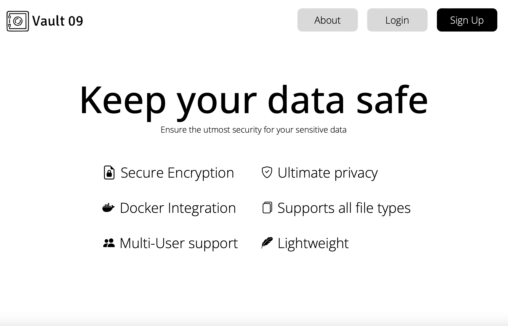
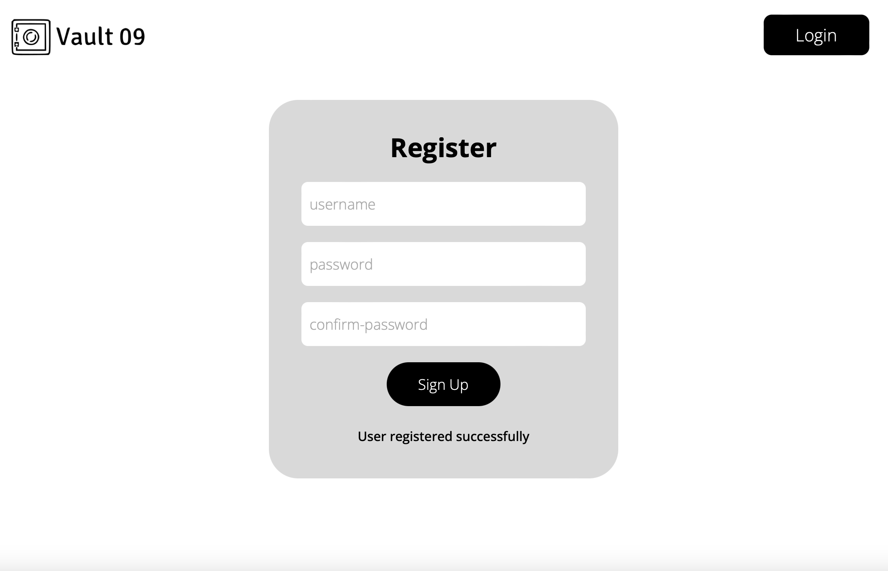
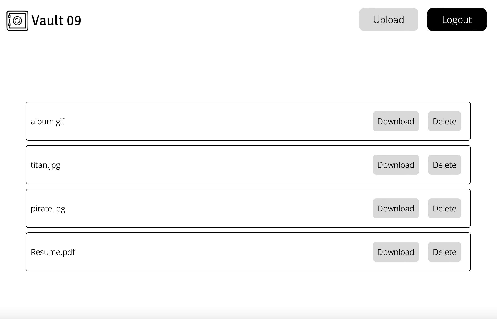
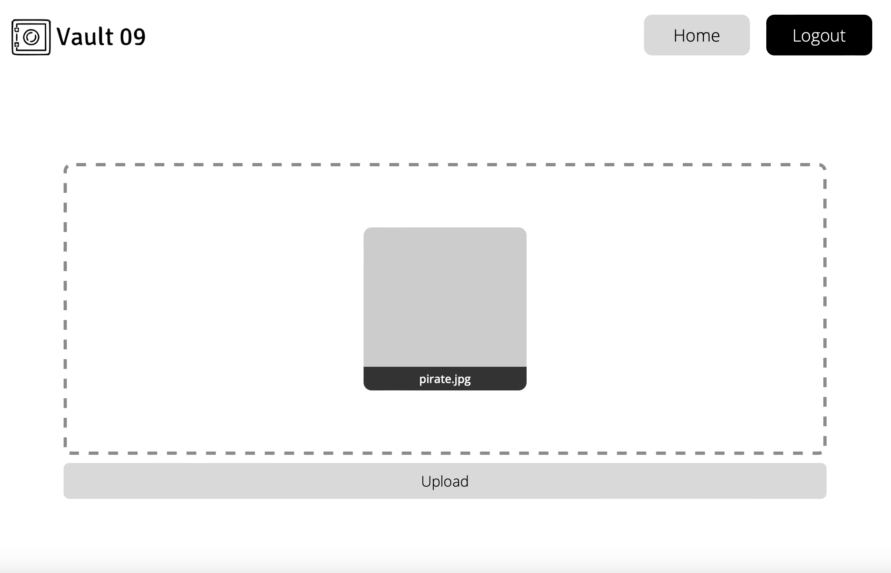

# Vault09
Vault09 is an application designed to provide secure and reliable file storage for users seeking to protect their valuable data.


Access the trial instance of the website at https://vault09.titancrew.online/

You can register yourself or use these creds:

```
username: Test123
password: Test123.
```

## Features:
- Strong encryption
- Supports all file types
- Deploy easily with docker
- Multi-User support
- Doesn't store encryption passwords or hashes

## Tech Stack
- Go
- MySQL
- HTML5
- CSS3
- JavaScript

## Installation

```bash
$ git clone https://github.com/TheAlpha16/Vault09
$ cd Vault09
$ docker compose up -d

Visit http://127.0.0.1:9909/ to access the site.
```

To know about docker installation check [this](https://docs.docker.com/engine/install/)

## Things to be noted

Please consider changing default MYSQL_USER and MYSQL_PASSWORD for database in [compose](./docker-compose.yml) file.

Currently file size is capped at 1GB. You can change it in [main.go](./secure/main.go) line-15.

## Glimpse





